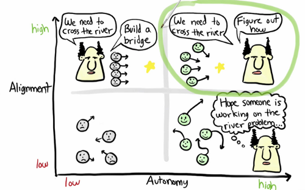

Um dos cases de sucesso do Spotify é a sua cultura ágil. Em 2018, quando seu primeiro player de música foi lançado, a empresa já utilizava Scrum em seus processos de desenvolvimento.

> Scrum é um framework de gerenciamento de projetos, ele proporciona organização no desenvolvimento ágil de produtos complexos, visando entregar o  mais alto valor possível através de várias técnicas."

Com o passar de alguns anos a quantidade de times dentro da empresa começou a aumentar, e a empresa foi notando que ser ágil vai muito além dos princípios de qualquer framework, um dos motivos pelo qual fez a empresa realizar algumas adaptações no seu processo de desenvolvimento. A empresa então decidiu deixar algumas regras do *scrum* como opcionais, renomeou o papel *scrum master* para *agile coach* pois queriam possuír mais líderes do que mestres em processos, passou a utilizar o termo *squads* no lugar de times *scrum* pois queria tornar esse grupo de pessoas mais autônomos. 

### Mas porque as squads se tornariam mais  autônomas? 🤔

A resposta é simples, cada *squad* possui um time multifuncional e auto organizado, geralmente com menos de oito pessoas. Eles sentam juntos e possuem total responsabilidade pelo que desenvolvem, sustentam e entregam. Cada *squad* possui sua missão a longo prazo, como por exemplo, uma das *squad* da empresa, que tem como objetivo tornar o Spotify o lugar ideal para colecionar músicas e escutá-las. A autonomia das *squad* representa decidir o que construir, como construir e principalmente como trabalhar em conjunto durante o processo de desenvolvimento. 

Todos os escritórios da empresa são otimizados para atender a necessidade das *squads* focando na colaboração, onde todos os membros de uma determinada *squad* trabalham juntos, com mesas ajustáveis e com fácil acesso a tela uns dos outros. A autonomia é motivadora e os torna mais velozes, deixando as decisões acontecerem ali mesmo, na hora, ao invés de um monte de reuniões. Isso ajuda a minimizar o tempo de espera das decisões e assim se consegue escalar sem que haja uma sobrecarga de dependências.

Apesar de cada *squad* possuir sua própria missão, é necessário que elas andem alinhadas com a estratégia do produto, prazos e prioridades e, principalmente com as demais *squads*, como uma banda por exemplo, onde apesar de cada músico tocar seu próprio instrumento, sabe que precisa estar alinhado com os demais músicos para que cheguem ao melhor resultado, que é entregar uma boa música para seus ouvintes. O grande objetivo deste conceito é diminuir o acoplamento mas manter a proximidade e o alinhamento entre as *squads*. 

Alinhamento e autonomia podem ser vistos em diferentes extremos em uma escala: **pouco alinhamento e pouca autonomia** faz com que os times fiquem perdidos, impedidos de decidir e sem conhecimento algum do que fazer; **bastante alinhamento e pouca autonomia** faz com que o líder diga aos times o que é necessário para alcançar o objetivo e o time faz; **bastante alinhamento e bastante autonomia** faz com que o líder diga aos times o que é necessário para alcançar o objetivo e os times decidem a melhor maneira para resolver; **pouco alinhamento e bastante autonomia** faz com que os times não estejam alinhados, caminhando para direções totalmente opostas.

Veja a representação dos exemplos acima na imagem abaixo:

### Conclusão

O spotify realizou diversas mudanças na sua cultura ágil de modo que conseguisse criar equipes que pudessem cuidar e ser responsável por produtos mais específicos, gerando assim, através do alinhamento dessas equipes mais autonomia. Além disso, o trabalho dos líderes passou a ser mais de comunicar do que tomar decisões, ele comunica o tipo de problema e o porquê, enquanto as *squads* colaboram umas com as outras para descobrir a melhor solução e ter sua tomada de decisão.