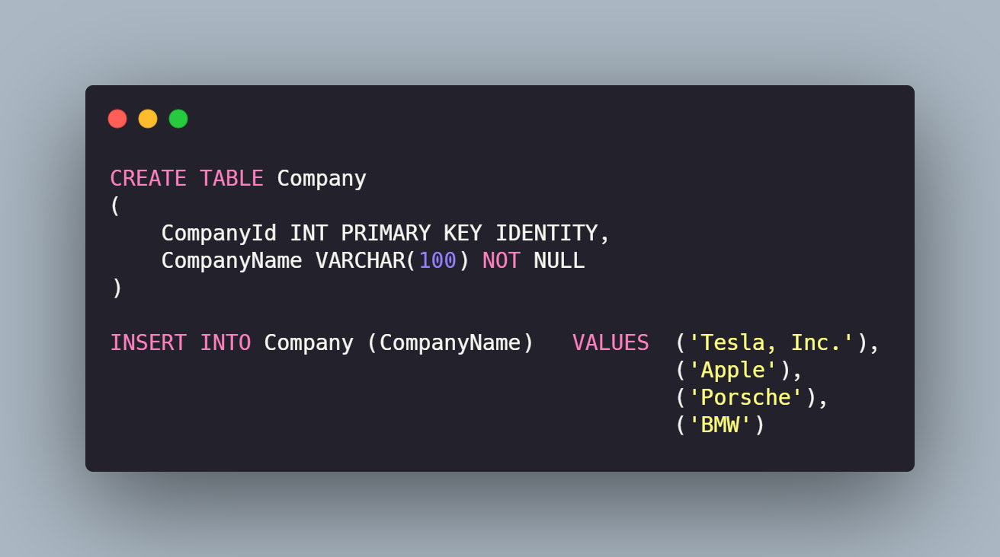
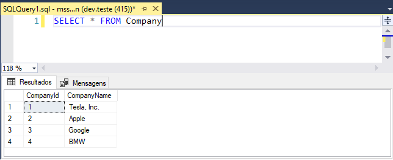
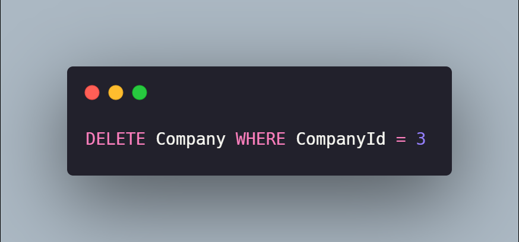
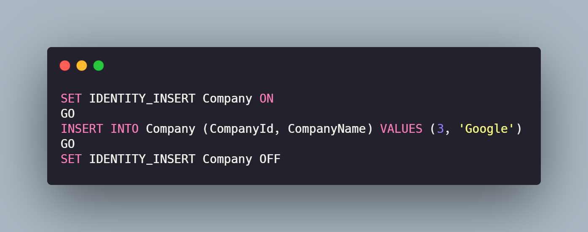
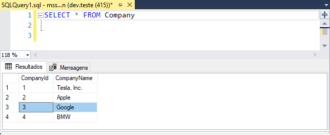

### Entendendo o Cenário

Quando utilizamos uma tabela cujo a coluna de identidade é auto incremental, um problema muito comum de enfrentarmos é a necessidade de informar um valor à coluna de identidade, isso porque nós queremos burlar a maneira em que a tabela foi modelada e setar "na mão" um valor para o registro que estamos inserindo.

### Preparando o Cenário

Para exemplificar o cenário, vamos criar uma tabela chamada **Company**, esta tabela irá possuir duas colunas: **CompanyId** e **CompanyName**. Vamos também, inserir quatro registros nessa tabela que irão nos ajudar a reproduzir o cenário. 

Execute o comando SELECT na tabela para visualizar os registros inseridos na tabela:

Legal, todos os registros foram inseridos, agora vamos deletar um desses registros. Execute o comando abaixo para remover o registro com identificador 3:

Execute o comando SELECT novamente na tabela para visualizar os registros após a execução do comando de DELETE:

Perceba que o registro referente à Porsche não está mais na lista, como o registro foi deletado, os valores da coluna de identidade ficaram com uma lacuna.

**E se quisermos preencher esta lacuna?** 🤨

Vamos tentar? Execute o comando abaixo para inserirmos um novo registro informando o valor da coluna CompanyId:

Como tentamos executar o comando INSERT informando um valor para a coluna de identidade, recebemos a seguinte mensagem do SQL Server.

Isso acontece pois a tabela não foi modelada para isso, ela de fato foi modelada para que os valores dessa coluna sejam gerados de mandeira incremental e automática.

### OK! Mas e como podemos preencher esta lacuna então?

Se você não conhece, eu lhe apresento. O IDENTITY_INSERT nos permite inserir valores explícitos na coluna de identidade de uma tabela. A única premissa é que o usuário autenticado no banco de dados tenha permissão para realizar ALTER na tabela ou que seja *owner* da mesma.

<blockquote>
Lembrando que este é um comando nativo do SQL Server, executá-lo em outros bancos de dados não irá funcionar.
</blockquote>

Para fazer a inserção e preencher a lacuna que deixamos por causa do delete, basta seguir o exemplo abaixo:

Execute novamente um comando SELECT na tabela e... 

**TCHARANNNNN**! Perceba que temos novamente um registro com o valor de identidade 3, legal né?  😎

