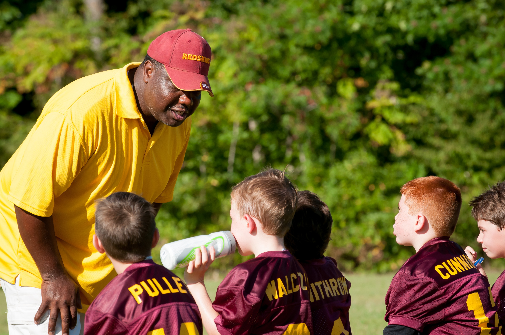
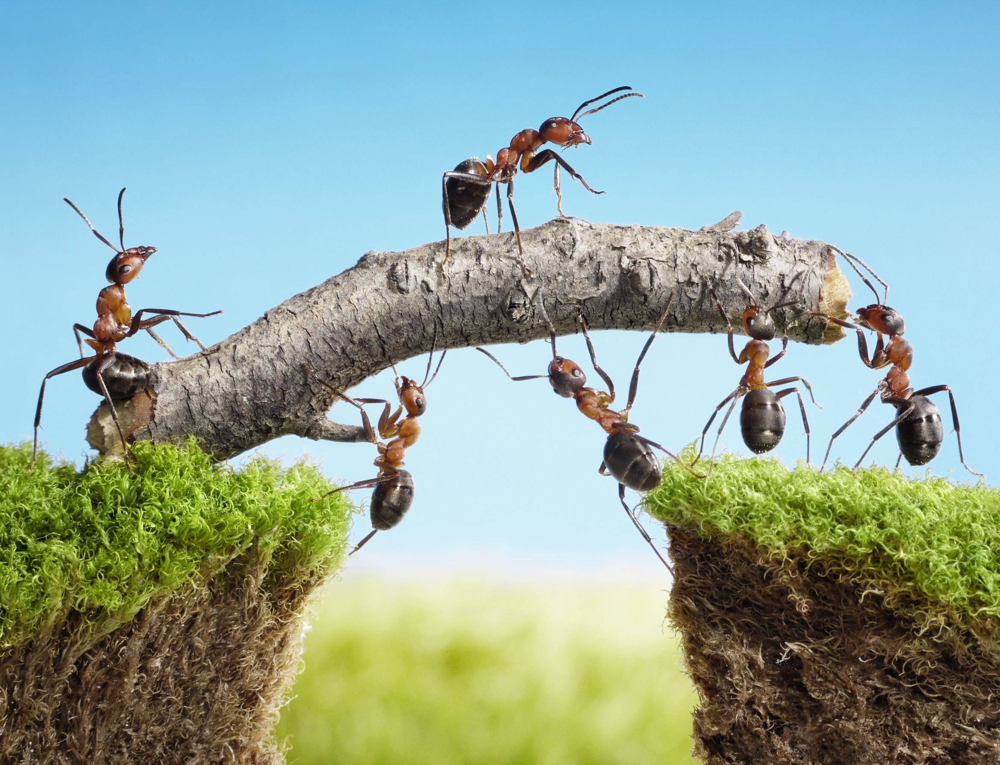

[Bruce Tuckman]([https://link](https://en.wikipedia.org/wiki/Bruce_Tuckman)), foi um pesquisador americano nascido em 1938, ele ficou conhecido por uma de suas teorias que explicava os estágios de desenvolvimento de uma equipe, mais conhecida como *Tuckman's stages of group development*. Ela foi publicada em 1965, e basicamente era dividida em quatro ciclos: *forming, storming, norming e performing*.
 
 

### Forming
O primeiro ciclo é onde forma-se uma nova equipe, a liderança explica o propósito e objetivos desta equipe para seus membros que geralmente sentem um certo receio pelo momento de adaptação e iteração que se fará presente todos os dias. Ainda não há engajamento, neste caso o papel do lider torna-se fundamental para conseguir deixar explícito qual rumo deve-se seguir e acompanhar a evolução desta equipe.
  

 
 

### Storming
O segundo ciclo inicia quando os membros da equipe começam a se confrontar. Neste cilo, as metas da equipe já estão definidas mas as responsabilidades e papéis de cada integrante ainda não, gerando dificuldades de se chegar em um senso comum, conflitos e desconforto para essas pessoas. Neste caso, o papel do líder continua sendo fundamental de modo que consiga acompanhar a evolução da equipe e ser um facilitador na resolução desses conflitos.
  

 
 

### Norming
O terceiro ciclo trata a normalização da equipe. Nele, os processo já estão definidos e o entusiasmo e níveis de competência dos membros cresce. Os integrantes já conhecem uns aos outros, e tanto o respeito quanto o trabalho em equipe começam a se fazer presentes no dia-dia da equipe.

 
 
  
### Performing 
O quarto ciclo aborda a performatização da equipe. Nele, a equipe já executa o trabalho de modo muito produtivo e performático, começa a tornar-se auto gerenciável, organizada, e cada membro da equipe sabe seu papel e a importância que ele tem para que os objetivos da equipe sejam atingidos. Ainda neste ciclo, a equipe exibe um sentimento de orgulho muito grande em fazer parte daquele grupo, a necessidade do líder para resolução de problemas torna-se cada vez menor.

 
 

### Adjourning

Em 1977, junto de Mary Ann Jensen, Bruce Thuckman acrescentou um quinto ciclo em sua teoria, este ciclo é conhecido como *Adjourning*. Ele aborda o fim desse lindo processo de formação de equipe, neste ciclo todos os objetivos da equipe foram alcançados, e junto do sentimento de orgulho pelo trabalho realizado existe a angústia pelo desconhecimento de quais serão as próximas páginas dessa jornada. A equipe pode ser mantida ou desmembrada, tudo depende da estratégia adotada por quem a lidera. O papel do líder torna-se novamente fundamental, pois será o principal responsável por definir o futuro de cada membro da equipe.

 
 

## Conclusão
Quem já teve a oportunidade de trabalhar em uma equipe desde sua criação até a entrega do objetivo final muito provavelmente já vivenciou os ciclos abordados pela teoria de Bruce Thuckman. A teoria explica básicamente as fases que um grupo de pessoas passa durante o percurso para atender um grande objetivo. Esse percurso carregará consigo o processo de formação, turbulência, normatização, performatização e dissolução/transformação da equipe. 

.
 
.

Deixa aqui nos comentários qual o ciclo que sua atual equipe está vivenciando. Forming, storming, norming, performing ou adjourning?